# CM Automations

**One automated operating system you can roll out to any business, in any niche.**

It has three connected systems plus an automation engine that links them:

| System | What it does |
|---|---|
| 🚀 **Build Funnel** | Takes a product or service from a rough idea to fully built and launched, in **9 stages and 36 guided steps**. Each step says why it matters, what to do and when it's done. |
| ✨ **Content Studio** | Builds the content strategy and generates the ideas and creation briefs. It teaches the client how to make each piece. The client finalises it, and the system publishes it at the scheduled time. |
| 👥 **CRM** + ✅ **Task Manager** | Handles leads, the deal pipeline, follow-ups and the team's daily tasks. Automations do the routine admin, and team wins and kudos help keep morale up. |
| 💬 **Assistant** | A chat helper on every page. It works out the problem, takes you to the screen that solves it and points at the right button. It also answers questions from your own data, creates tasks and logs issues. |
| 🛟 **Help Desk** | Tracks every problem until it's sorted. Issues are auto-assigned, each priority has a response target, missed targets are escalated, and the person who raised it is told when it's fixed. |
| 📞 **Messages, calls & WhatsApp** | One inbox for WhatsApp, texts and email. Calls to the business number ring the owner's mobile; missed callers are texted back in seconds; emergencies ("leak", "no power") alert the whole team. Built so trades never miss a job while they're on the tools. |
| 📅 **Bookings** | Online booking page with live availability, deposits, day-before and 2-hour reminders (reply C to confirm, R to rearrange), "on my way" texts, a morning job sheet to the team's phone and a calendar feed for Google, Outlook and iPhone. |
| 💷 **Quotes, invoices & payments** | Deal or finished job → quote (accepted online) → invoice with a card-payment link. Overdue invoices are chased automatically: friendly, firmer, then a call task for a person. |
| 🧭 **Agency control centre** | For the agency running all of this: every client on one screen with a health score, the audit → proposal → new client flow, white-label branding and an automatic monthly report per client. |
| ⚡ **Automation engine** | Uses WHEN → IF → THEN rules to connect all of the above. It also logs the time it saves each business. |

The design uses a deep nautical sky blue on a white background with black text. Headers and key figures are in blue text.

---

## Screenshots

All screenshots come from the running app with the built-in demo business (`npm run screenshots` regenerates them).

### Dashboard


### Build Funnel
| Overview of builds & the 9-stage journey | A guided step with its worksheet |
|---|---|
|  |  |


### Content Studio
| Idea Lab | Creation brief → client finalises |
|---|---|
|  |  |

| Creation board | Scheduling calendar |
|---|---|
|  |  |

| Strategy (brand profile & pillars) | Creation Academy |
|---|---|
|  |  |

### CRM
| Pipeline | Contacts & timeline |
|---|---|
|  |  |

### Tasks & Automations
| Task board | My day |
|---|---|
|  |  |


### Help Desk & Assistant
| Help Desk | Assistant |
|---|---|
| 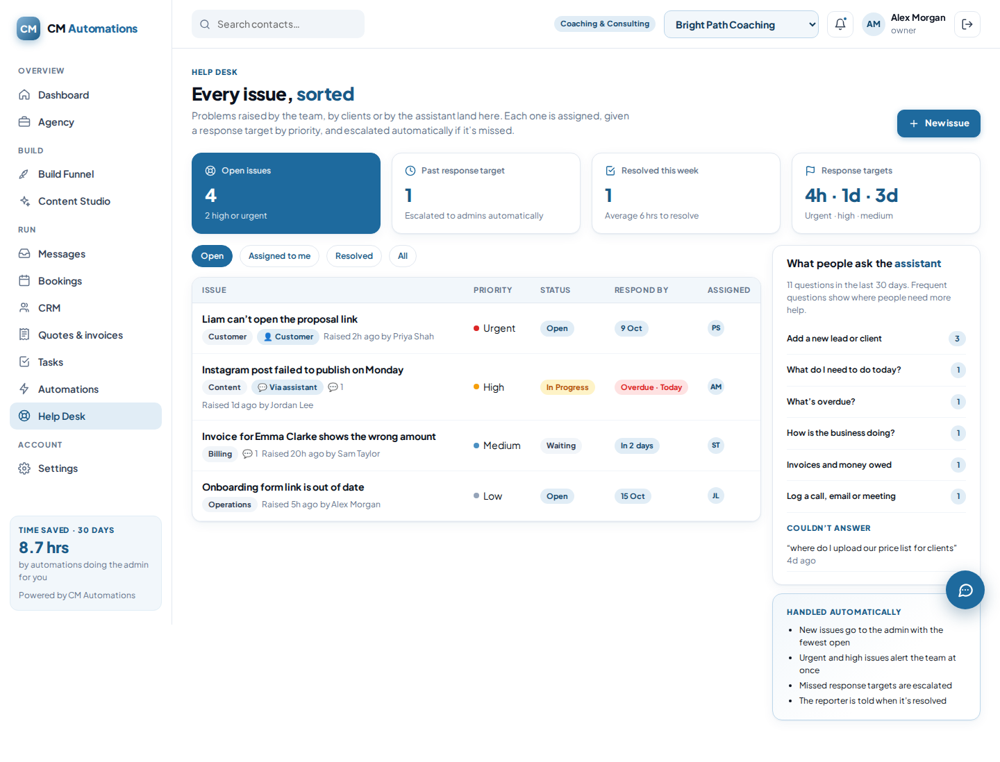 | 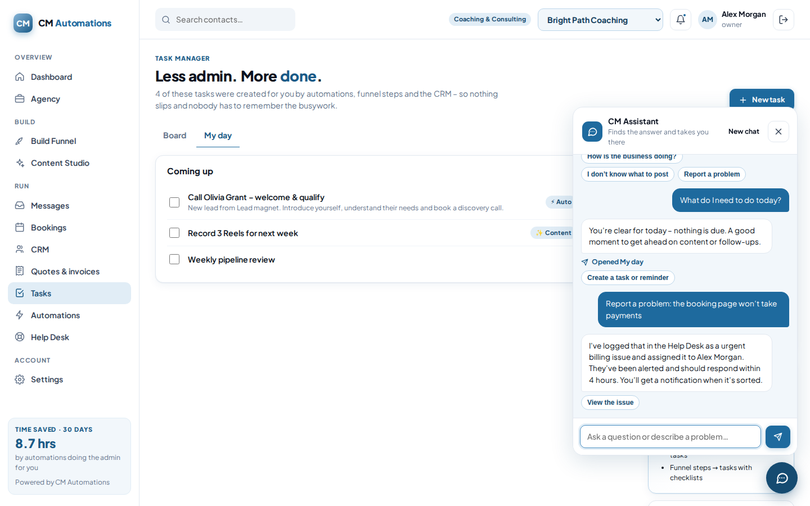 |

### Messages, calls & WhatsApp (Swift Plumbing & Heating)
| One inbox – the emergency is flagged 🚨 | Missed calls texted back in seconds |
|---|---|
| 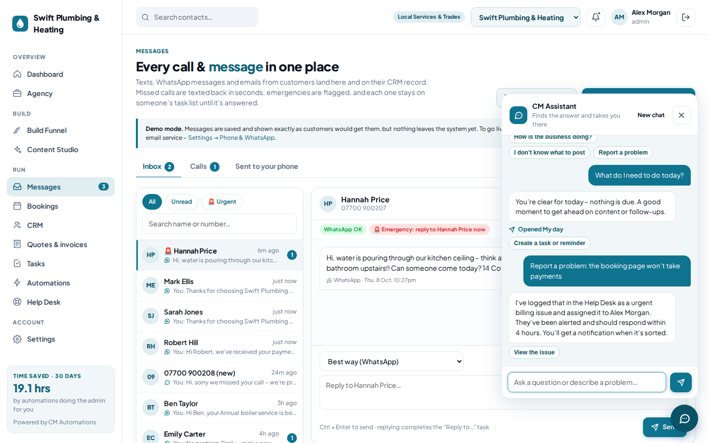 | 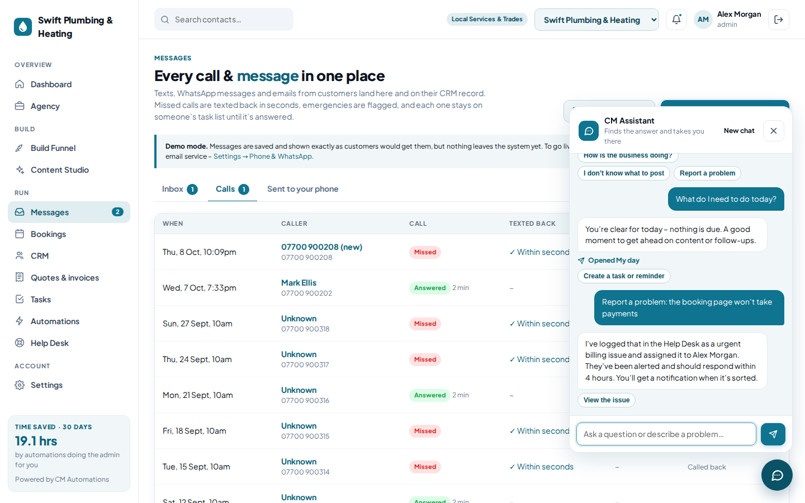 |

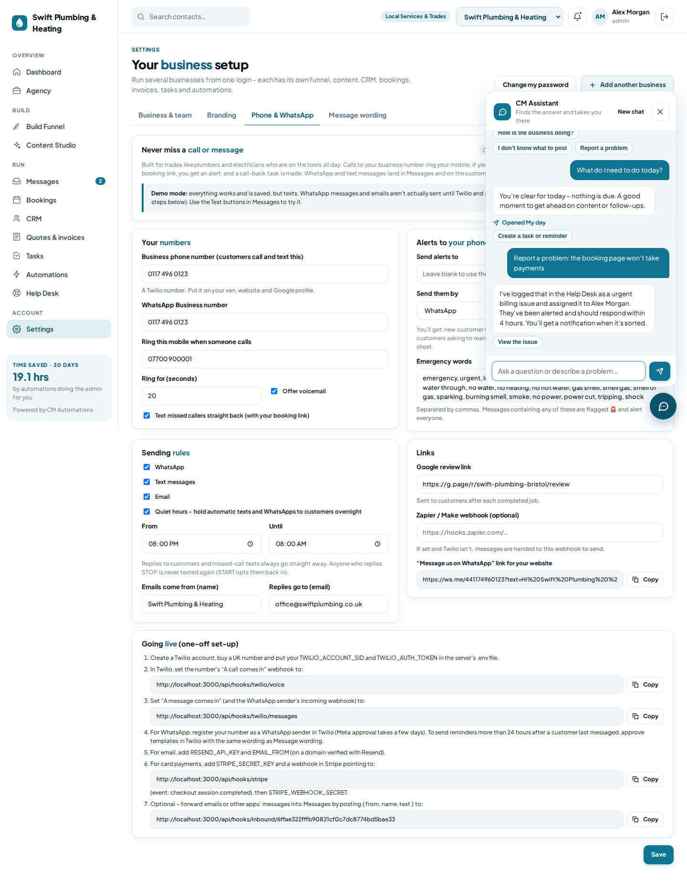

### Bookings
| The diary | Today's jobs (for the van) |
|---|---|
| 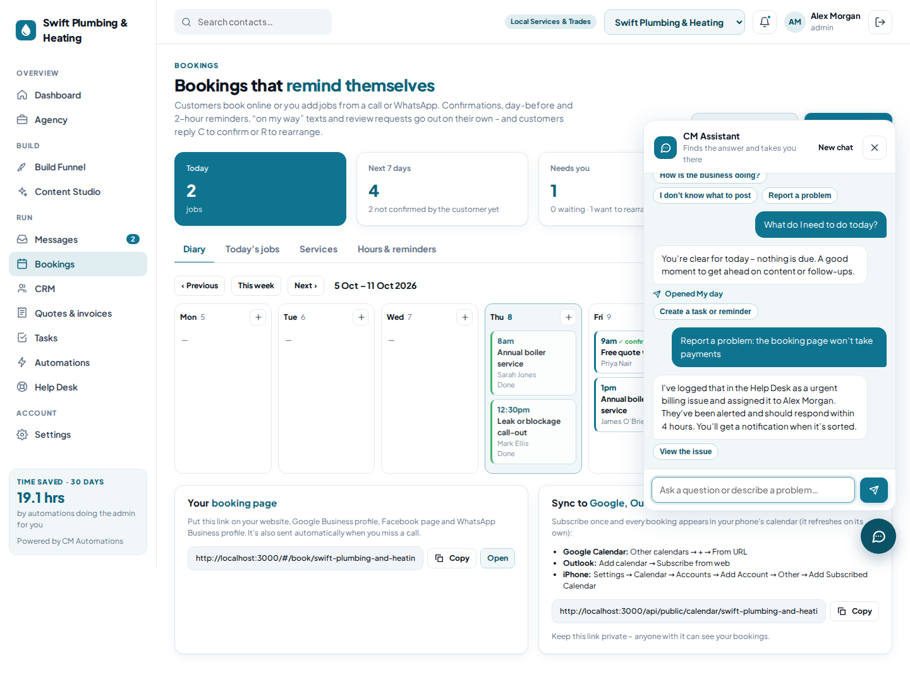 | 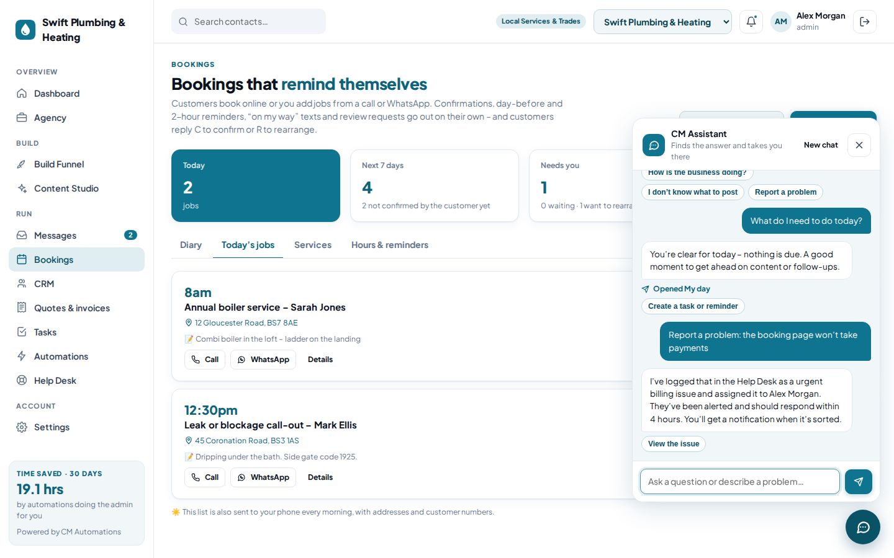 |

### Quotes, invoices & what customers see
| Quotes & invoices | The customer's booking page | The customer's invoice |
|---|---|---|
| 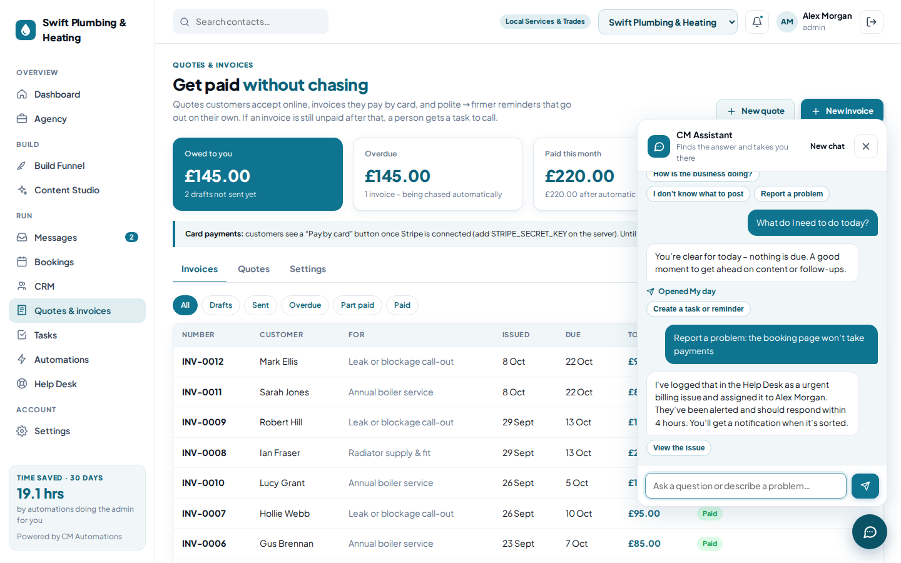 | 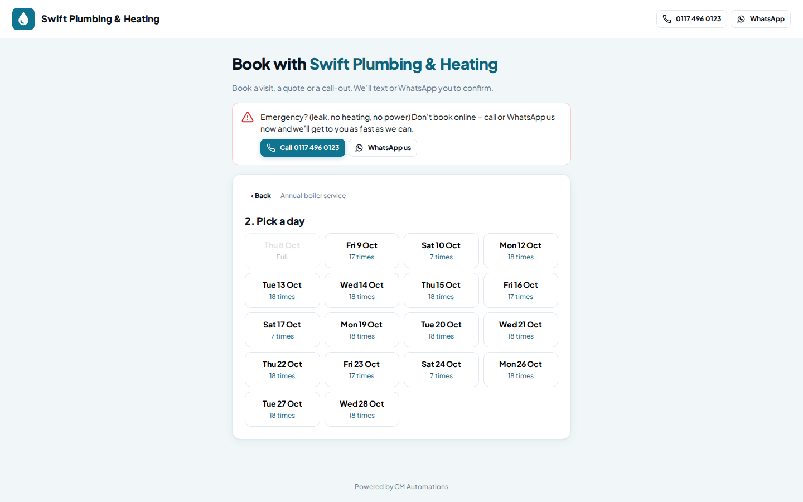 | 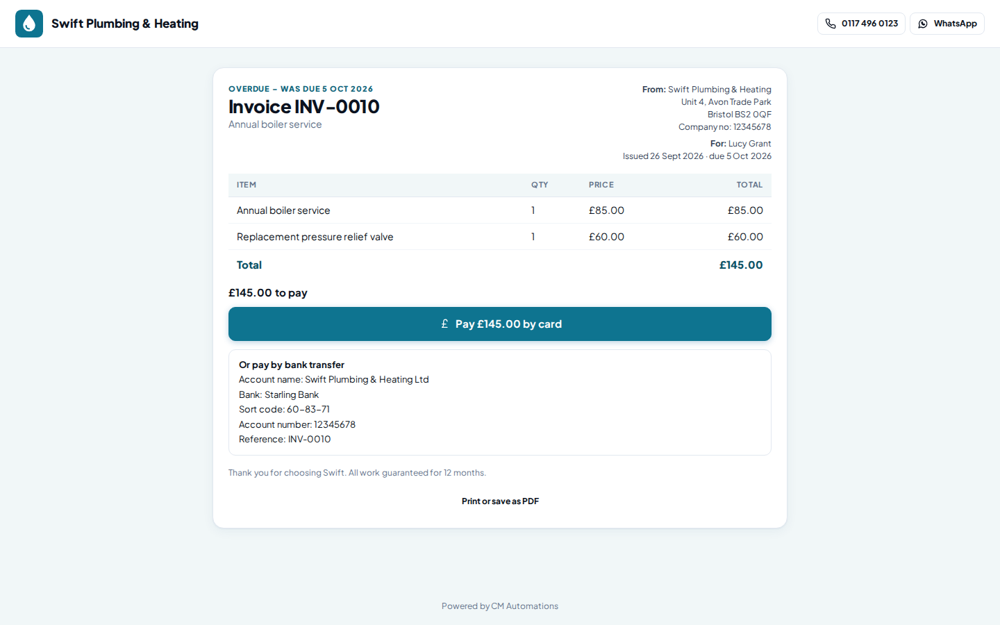 |

### Agency
| Control centre | Proposal the client accepts online | Client's monthly report |
|---|---|---|
| 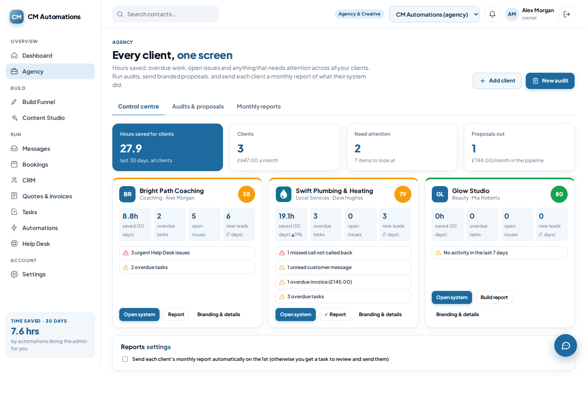 | 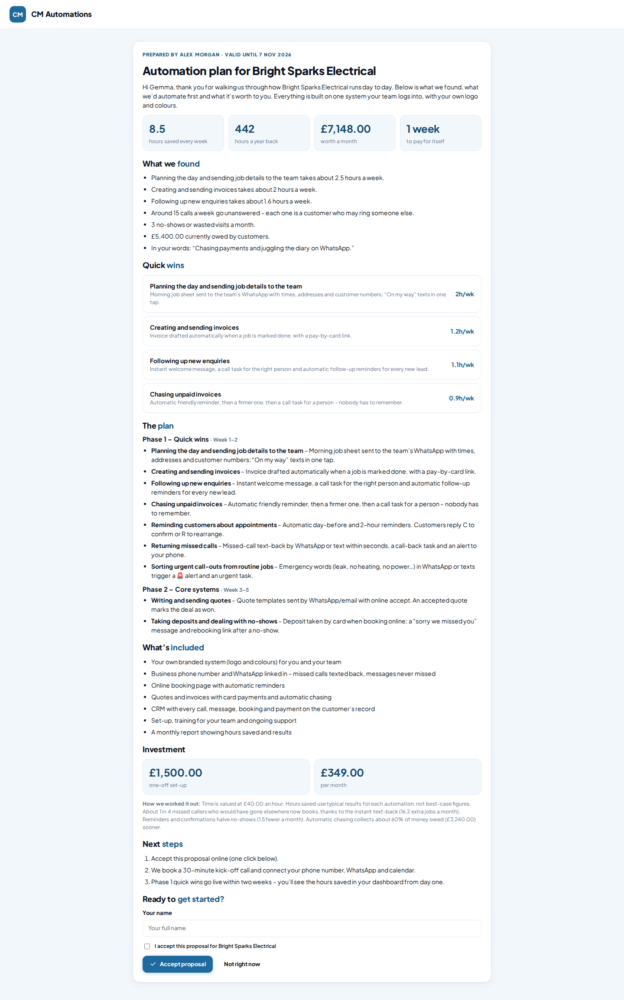 | 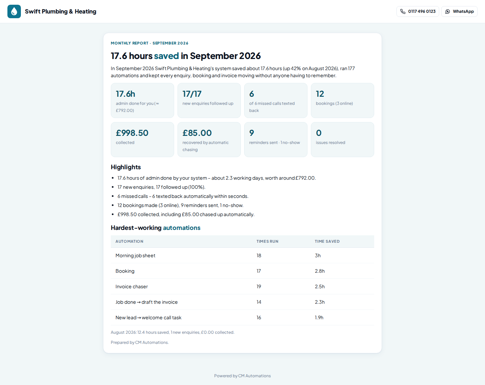 |

---

## Quick start

Requirements: **Node.js 22.13 or newer**. The database is SQLite, built into Node, so there's nothing else to install.

```bash
npm install
npm start            # http://localhost:3000
```

On first start the server seeds demo data. Sign in with:

- **Email:** `demo@cmautomations.com` (the agency owner – sees every business and the Agency control centre)
- **Email:** `dave@swiftplumbing.co.uk` (the owner of Swift Plumbing & Heating – a client's view)
- **Password:** `demo1234` for both

Other commands:

```bash
npm run dev          # restart on file changes
npm run seed         # reset the database with fresh demo data
npm test             # API + automation test suite
npm run screenshots  # regenerate docs/screenshots (uses Playwright)
```

Configuration is in `.env` (see `.env.example`):

| Variable | Default | Purpose |
|---|---|---|
| `PORT` | `3000` | Web + API port |
| `DATABASE_PATH` | `./data/cm-automations.db` | SQLite file |
| `SCHEDULER_INTERVAL_SECONDS` | `30` | How often publishing, reminders and follow-ups run |
| `REQUIRE_PASSWORDS` | `true` | Sign-in needs a password. `false` switches to email-only sign-in for short test sessions. |
| `ANTHROPIC_API_KEY` | – | Optional. Turns on AI idea generation in the Idea Lab and upgrades the assistant to Claude. Without it, the built-in idea engine and built-in assistant are used. |
| `PUBLIC_URL` | `http://localhost:3000` | The address customers reach the system on. Used in links sent by text, WhatsApp and email, and for webhook signatures. |
| `TWILIO_ACCOUNT_SID`, `TWILIO_AUTH_TOKEN` | – | Texts, WhatsApp, call forwarding and missed-call text-back. Without them, messages run in demo mode (saved and shown, not sent). |
| `RESEND_API_KEY`, `EMAIL_FROM` | – | Sends email through Resend. `EMAIL_FROM` must be on a verified domain. |
| `STRIPE_SECRET_KEY`, `STRIPE_WEBHOOK_SECRET` | – | Card payments for invoices and booking deposits through Stripe Checkout. Without them, invoices show bank details. |

---

## Browser test build

`npm run build:test` packs the whole system into one self-contained page at `dist/test-build/cm-automations.html`: the front end, the real server modules and SQLite (via sql.js). The page needs no server and no network connection, and it can be hosted anywhere or opened locally (`dist/test-build/index.html`).

- `demo/` holds the browser stand-ins for the few Node modules the server uses (`node:sqlite`, `node:crypto`, `node:fs`, Express's router), plus the boot script.
- Data is saved in the viewer's browser, and **Reset data** restores the demo business.
- A **Walkthrough** panel guides testers through every section. The same steps are written to [`docs/WALKTHROUGH.md`](docs/WALKTHROUGH.md).
- In this build, publishing, texts, WhatsApp, email and card payments are simulated (shown as "Demo – not actually sent" and a pretend card form), calls and customer messages are simulated with the **Test** buttons in Messages, and timed automations run every 30 seconds while the page is open.

---

## Rolling it out to a new business

1. The business signs up (or you use **Settings → Add another business** to run several businesses from one login).
2. They choose a **niche**. The system then loads:
   - an audience profile, pains, desires and offers
   - 4 content pillars and default publishing channels
   - all the recommended automations, switched on (a couple that send messages unprompted start switched off)
3. They start a build in **Build Funnel**, generate ideas in **Content Studio** and add leads in the **CRM**. The automations handle the rest.

Supported niches: Coaching & Consulting, E-commerce, Local Services & Trades, Health & Fitness, Beauty & Salon, Hospitality & Food, Agency & Creative, Real Estate, and Software & Tech. You add a niche with one entry in `server/modules/core/niches.js`.

---

## How each system works

### 1. Build Funnel: from idea to fully built

| # | Stage | Steps |
|---|---|---|
| 1 | Idea & Clarity | One-sentence idea · ideal customer · problem & pain · transformation · your edge |
| 2 | Market Validation | Competitor scan · 10 customer conversations · demand signals · go / pivot / stop |
| 3 | Offer Design | Core offer · value stack & bonuses · guarantee · name & positioning |
| 4 | Pricing & Economics | Cost to deliver · pricing model & tiers · **auto-calculated unit economics** · payments |
| 5 | Build | *Product:* MVP scope, suppliers, prototype · *Service:* delivery map, templates & SOPs, onboarding · pilot with real customers |
| 6 | Brand & Sales Assets | Brand basics · **sales page draft auto-written from earlier answers** · lead magnet · social proof |
| 7 | Operations & Systems | Legal & admin · tool stack · switch on automations · support process |
| 8 | Launch | Launch plan · pre-launch content (links to Content Studio) · warm outreach · launch-day checklist |
| 9 | Grow & Optimise | 30-day numbers · feedback loop · 90-day plan |

- Every step has **Why this matters**, numbered **Do this** instructions, a **worksheet**, and a **Done when** finish line.
- Required answers are checked before a step can be completed, and stages unlock in order so nothing gets skipped.
- **Send to tasks** turns a step into Task Manager tasks, with its instructions as a checklist.
- Finishing a stage tells the team and creates a kick-off task for the next stage.
- The blueprint lives in `server/modules/funnel/blueprint.js`. Improve it once and every business gets the change.

### 2. Content Studio: strategy → ideas → brief → *client creates* → auto-publish

1. **Strategy:** a brand and audience profile plus content pillars, pre-filled from the niche.
2. **Idea Lab:** the idea engine combines 15 proven content frameworks with the business's pillars, pains, desires, offers and platforms. It scores each idea. Ideas are balanced across the customer journey (40% awareness, 30% consideration, 20% conversion, 10% retention), and the engine favours stages that are under-represented. With `ANTHROPIC_API_KEY` set you can also pick **AI (Claude)** as the engine.
3. **Creation brief:** 3 hook options, the structure, audience, tone, call to action, hashtags, step-by-step *how to create this format* instructions, and a pre-publish checklist.
4. **The client finalises:** they write the final caption or script in their own words and add the media link. Only finalised content can be scheduled.
5. **Schedule:** choose channels and a time, or use one of the suggested free slots. The scheduler publishes it automatically, retries failures and raises an urgent fix task if a post still fails.
6. **Creation Academy:** short lessons on Reels and TikTok, carousels, stories, text posts, YouTube, newsletters, hooks and batching.

**Publishing adapters** (`server/automation/publishers.js`):
- `webhook` sends the post to Zapier, Make, n8n, Buffer or your own integration, which posts it to the real platform.
- `simulated` is for demos and training.

Native platform APIs can be added as new adapters with the same signature.

### 3. CRM & Task Manager: day-to-day admin handled

- **CRM:** contacts with lifecycle stages, a drag-and-drop deal pipeline, an activity timeline, follow-up dates and bulk import.
- **Tasks:** a Kanban board and a **My day** view, with priorities, checklists, recurring tasks and team workload.
- **Morale:** a team wins feed (completed tasks and won deals), kudos with notifications, and workload balancing.

### 4. Assistant: help on every page

Open it with the round chat button in the bottom-right corner. It can:

- **Take you to the fix.** It recognises about 45 everyday problems and questions across every section ("how do I add a lead", "I don't know what to post", "a stage is locked", "connect Instagram"). It opens the right screen and points at the button to press. If the button sits under the chat panel, the panel tucks itself away.
- **Answer from your data,** for example "What do I need to do today?", "What's overdue?", "How is the business doing?", "Who do I need to follow up with?" or "Where am I with my build?".
- **Do things:**
  - "Remind me to call Emma tomorrow" creates a dated task.
  - "Add a lead called Sam Jones" opens the lead form with the name filled in.
  - "Find Emma" looks up a contact.
  - "Report a problem: …" logs a Help Desk issue with a sensible category and priority, and alerts the right person.
- **Respect permissions.** Team members asking about owner/admin-only changes are offered "Ask an admin", and the assistant raises it for them.
- **Admit when it doesn't know.** It offers the closest matches or logs the question for a person to pick up. Every question is recorded, and the Help Desk shows owners **what people ask most** and **what the assistant couldn't answer**, so you can see where clients and staff get stuck.

There are two engines with the same abilities and the same reply format:

- **Built-in** (`server/modules/assistant/engine.js` + `knowledge.js`) works with no setup. Add a topic to `knowledge.js` to teach it something new.
- **Claude** (`ai.js`) is used automatically when `ANTHROPIC_API_KEY` is set. Claude calls the same abilities as tools: navigate, read business data, search contacts, create tasks and raise issues. If the AI is ever unavailable, the built-in engine answers instead.

### 5. Help Desk: problems tracked until they're sorted

- Issues come from the team, from clients or from the assistant. Each one has a category, priority, status, assignee and updates thread.
- New issues go to the owner/admin with the fewest open issues, unless you pick someone.
- **Response targets:** urgent 4 hours, high 1 day, medium 3 days, low 7 days. Missed targets are escalated to the assignee and admins (once).
- Resolving an issue needs a short note, and the person who raised it is notified with that note.

### 6. Messages, calls & WhatsApp – never miss a job

Made for trades like plumbers and electricians, who can't answer the phone up a ladder or under a sink:

- **Calls** to the business number (a Twilio number) ring the owner's mobile. If nobody answers, the caller hears a short message and can leave a voicemail – and is **texted straight back** (by WhatsApp if they use it) with the booking link. A "Call back" task is made and the team's phone gets an alert. Repeat calls within 30 minutes don't send a second text.
- **WhatsApp and text messages** land in one inbox and on the customer's CRM record. New numbers become contacts automatically; photos customers send (a leak, a fuse box) are kept with the message.
- **Emergencies:** messages with words like "leak", "burst", "no heating" or "no power" are flagged 🚨, everyone is alerted and an urgent reply task is made. The words are editable.
- **Nothing slips:** every customer message creates a "Reply to…" task that closes itself when someone replies from the inbox.
- **Booking replies:** customers reply **C** to confirm or **R** to rearrange their next booking.
- **Respectful sending:** STOP/START opt-outs, quiet hours (texts wait until morning), and WhatsApp's 24-hour rule (outside it, an approved template is used or it falls back to a text).
- **Team alerts** go to a mobile by WhatsApp or text: new messages, missed calls, new bookings, rearrange requests, unpaid invoices and the morning job sheet.
- Every automatic message's wording is editable per business (Settings → Message wording).

Going live: buy a UK number in Twilio, add the keys to `.env`, and paste the two webhook addresses shown in **Settings → Phone & WhatsApp** into Twilio. Webhooks are verified with Twilio's signature. Without keys everything runs in demo mode, and the **Test a missed call / Test an incoming WhatsApp** buttons run exactly the same code.

### 7. Bookings

- **Services** with length, travel/tidy-up time, price and optional deposit.
- **Opening hours**, how many jobs can run at once (e.g. number of engineers), minimum notice, how far ahead, and time off.
- **Booking page** (`/#/book/<business>`): pick a service, day and time; trades also give the address and the problem. Online bookings create or update the contact, confirm by WhatsApp/text/email and alert the team. A deposit holds the booking until it's paid by card.
- **The customer's own page** to confirm, move or cancel (within the notice period), and add it to their calendar.
- **Reminders** the day before (at a set time) and 2 hours before – never in quiet hours.
- **Today's jobs** for the van: call, WhatsApp, directions, "On my way" with an ETA, Done (drafts the invoice and queues a review request) and No-show (sends a rebooking link).
- **Morning job sheet** to the team's phone, and a nudge if a finished job hasn't been closed off.
- **Calendar feed** (iCal) to subscribe to in Google Calendar, Outlook or iPhone.

### 8. Quotes, invoices & payments

- Quotes and invoices with line items, VAT per line (if registered), numbering and notes. Money is stored in pence.
- One click from a CRM deal or a finished job; a quote turns into an invoice.
- Customers open a branded link: they **accept a quote** (the deal moves to Won and a "book the work in" task is made) or **pay by card** through Stripe Checkout (recorded automatically from Stripe's signed webhook) or by bank transfer.
- **Automatic chasing** on the business's schedule (default 1, 7 and 14 days overdue): friendly reminder, firmer reminder, then an urgent task for a person to call. Can be paused per invoice. Unanswered quotes get a follow-up task.
- Part payments, cash and bank transfers are recorded by hand; a full payment sends a thank-you and marks the contact as a customer.

### 9. Agency control centre

- **Every client on one screen**: hours saved (with trend), overdue tasks, open issues, new leads, and a health score with "needs attention" items (urgent issues, missed calls not called back, unread messages, overdue invoices…). Click one to jump into that client's system.
- **White-label branding** per business: display name, logo and colour, applied to the app and every customer page, with an optional "Powered by" line.
- **Audit & proposal builder**: client details → discovery call → time & task audit (pre-loaded with the tasks businesses in that niche do by hand) → the system scores each task, picks the quick wins, estimates hours saved and money recovered (with its assumptions spelled out) and writes a branded proposal. When the client accepts online, their system is created with the agency team on it and a kick-off checklist.
- **Monthly reports** built automatically on the 1st for every client: hours saved and their value, leads followed up, missed calls texted back, bookings and no-shows, money collected and recovered by chasing, issues resolved and the hardest-working automations. Sent automatically or after review.

### 10. Lead forms

Build a form in **CRM → Lead forms**, share the link or paste the embed code into a website. Submissions create or update the contact (tagged), send a thank-you, and run the new-lead automations. Spam is filtered with a hidden field and rate limits.

### 11. Automation walkthrough presentation

Automations → **Watch the walkthrough** opens a 32-slide presentation for showing a client how an automation project works, from first conversation to results:

1. **The problem:** where the day goes and the hidden cost to staff.
2. **What changes:** before and after.
3. **The 8-step onboarding journey:** discovery call, time & task audit (with an example audit), quick wins, system design, build & connect, team training, go-live with support, monthly measure & improve. Each step covers what the client does, what we do and what they get.
4. **How it works:** the WHEN → IF → THEN rule and where AI fits, with people staying in control.
5. **Ten worked examples** (including missed-call text-back for trades, self-reminding bookings and automatic invoice chasing) that run in the system today, each with its flow, result and time saved, plus examples for six different niches.
6. **Your people:** how the system reduces pressure on staff.
7. **Results:** live figures from the business's own system, and how success is measured.
8. **Daily routines** by role, then next steps.

The presentation also has:

- **Presenter notes** on every slide (Notes, or press N).
- **Full-screen mode** (Present, or press F).
- Arrow keys and swipe to move between slides, and chapter tabs to jump around.
- "See it live" buttons that open the real feature mid-presentation.

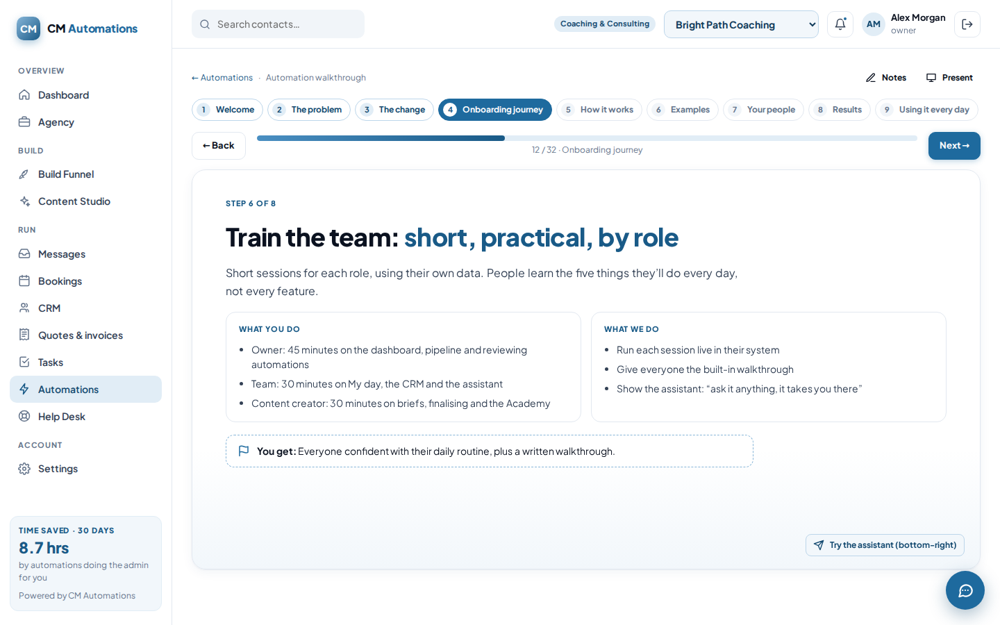

### ⚡ Built-in automations (installed for every business)

| When… | …the system |
|---|---|
| A lead is added | Creates a welcome-call task for tomorrow, sets a 3-day follow-up and logs it on the timeline |
| A follow-up date arrives | Creates a follow-up task |
| A deal moves to Proposal | Creates a chase task for 3 days later and marks the contact as a prospect |
| A deal is won | Marks the contact as a customer, creates an onboarding checklist task and tells the team |
| A deal is lost | Creates a feedback task and a 90-day check-in |
| A task is overdue | Reminds the assignee (once) |
| A funnel stage is completed | Tells the team and creates a kick-off task for the next stage |
| Content is finalised | Tells admins it's ready to schedule |
| A post fails to publish | Creates an urgent fix task with the error |
| Every morning | Sends each person their plan for the day |
| A recurring task is completed | Creates the next occurrence |
| A high or urgent issue is raised | Alerts owners and admins straight away |
| An issue is raised with an assignee | Tells the assignee it's theirs |
| An issue passes its response target | Reminds the assignee and escalates to admins |
| An issue is resolved | Tells whoever raised it, with the resolution |
| A new lead is added (not from a call, message, form or booking) | Sends an instant welcome message with the booking link |
| A customer's message mentions an emergency | Alerts everyone |
| An existing contact fills in a form | Creates a reply task |
| A booking is made | Tags the contact as booked |
| A job is marked done | Drafts the invoice and asks someone to check and send it |
| A customer doesn't turn up | Creates a call-back task |
| A quote is accepted | Tells the team and creates a "book the work in" task |
| An invoice is paid | Marks the contact as a customer |
| An agency proposal is accepted | Tells the agency team |

New automations added in a release are installed for existing businesses automatically, and one a business deleted on purpose is never brought back.

Businesses can switch any of these off, duplicate and edit them, or build their own in the visual **WHEN → IF → THEN** builder.

The available actions are: create a task, notify someone, update a contact, set a follow-up, log a CRM activity, send to a webhook, **send an email, text or WhatsApp** (to the customer or the team, optionally after a delay) and **draft an invoice**. Built-in steps also handle missed-call text-back, booking reminders, the job sheet, invoice chasing and monthly reports. Every run is logged with an estimate of the minutes saved, and that estimate drives the **time saved** figures in the app.

---

## Architecture

```
server/
  index.js                 starts the API, web app and scheduler
  app.js                   Express app (mounted by tests too)
  config.js                .env loading
  db/schema.sql            multi-tenant schema (every row has org_id)
  db/index.js              node:sqlite wrapper + JSON column helpers
  db/seed.js               demo business
  lib/auth.js              scrypt passwords, bearer-token sessions, roles
  lib/util.js              ids, dates, validation, templating
  automation/
    engine.js              triggers, conditions, actions, run log
    recipes.js             default automations per business
    scheduler.js           publishing, overdue, follow-ups, daily digest
    publishers.js          channel adapters (simulated, webhook)
    routes.js              /api/automations
  modules/
    core/                  auth, businesses, team, notifications, kudos, dashboard, niches
    funnel/                blueprint.js (the 9-stage journey) + routes
    content/               idea engine, briefs, academy, optional Claude AI, routes
    crm/                   contacts, deals, activities
    tasks/                 task service (recurrence) + routes
    helpdesk/              issues, response targets, comments
    assistant/             knowledge base, built-in engine, Claude engine, routes
    messaging/             templates, providers (Twilio, Resend, webhook, demo), inbox, calls
    bookings/              services, availability, reminders, job sheet, calendar feed
    billing/               quotes, invoices, payments, chasing, Stripe Checkout
    agency/                audit scoring, proposals, control centre, monthly reports
    forms/                 lead forms
    public/                pages customers open without signing in
    hooks/                 Twilio and Stripe webhooks (signature-checked)
public/                    front end: plain ES modules, no build step
  css/app.css              design system (nautical sky blue / white / black)
  js/app.js                router + layout
  js/pages/*.js            one file per module
  js/assistant.js          the chat panel on every page
tests/api.test.js          end-to-end API + automation tests
scripts/screenshots.mjs    renders every module to docs/screenshots
```

**Design choices**

- **Multi-tenant from day one.** Every table is scoped by `org_id`, and one login can belong to several businesses and switch between them.
- **Few dependencies.** Express is the only required package. SQLite is built into Node and there is no front-end build step, so moving the system to a new server or business is `npm install && npm start`.
- **Automations run synchronously.** The API response already includes their results, so the UI can show "⚡ automation ran" straight away, and the work stays predictable and testable.

### API overview

All endpoints are under `/api` and use `Authorization: Bearer <token>`, except the auth endpoints.

| Area | Endpoints |
|---|---|
| Auth & business | `POST /auth/register`, `POST /auth/login`, `POST /auth/switch`, `GET /me`, `POST /orgs`, `PATCH /org`, `GET/POST /team`, `GET /notifications`, `GET/POST /kudos`, `GET /dashboard` |
| Build Funnel | `GET /funnel/blueprint`, `GET/POST /funnel/projects`, `GET/PATCH/DELETE /funnel/projects/:id`, `PATCH /funnel/projects/:id/steps/:step`, `POST /funnel/projects/:id/steps/:step/tasks` |
| Content | `GET/PUT /content/profile`, `/content/pillars`, `GET /content/ideas`, `POST /content/ideas/generate`, `POST /content/ideas/:id/brief`, `/finalise`, `/schedule`, `GET /content/calendar`, `GET /content/slots`, `PATCH /content/posts/:id`, `POST /content/posts/:id/publish-now`, `/content/channels`, `GET /content/academy` |
| CRM | `GET/POST /crm/contacts`, `POST /crm/contacts/import`, `GET/PATCH/DELETE /crm/contacts/:id`, `POST /crm/contacts/:id/activities`, `GET /crm/pipeline`, `POST /crm/deals`, `PATCH/DELETE /crm/deals/:id` |
| Tasks | `GET/POST /tasks`, `GET /tasks/workload`, `GET/PATCH/DELETE /tasks/:id` |
| Automations | `GET/POST /automations`, `PATCH/DELETE /automations/:id`, `POST /automations/:id/test`, `GET /automations/runs`, `GET /automations/impact`, `GET /automations/meta` |
| Help Desk | `GET /helpdesk/meta`, `GET/POST /helpdesk/issues`, `GET/PATCH/DELETE /helpdesk/issues/:id`, `POST /helpdesk/issues/:id/comments`, `GET /helpdesk/stats` |
| Assistant | `GET /assistant/meta`, `POST /assistant/chat`, `GET /assistant/insights` (owners/admins) |
| Messages | `GET /messages/summary`, `GET /messages/threads`, `GET /messages/threads/:contactId`, `POST /messages/threads/:contactId/send`, `GET /messages/calls`, `POST /messages/calls/:id/handled`, `GET /messages/alerts`, `GET/PUT/DELETE /messages/templates/:key`, `GET/PUT /messages/settings`, `POST /messages/simulate/inbound`, `POST /messages/simulate/missed-call` |
| Bookings | `GET/POST /bookings`, `GET /bookings/overview`, `GET /bookings/today`, `GET/PATCH /bookings/:id`, `POST /bookings/:id/status`, `/remind`, `/invoice`, `GET/POST/PATCH/DELETE /bookings/services`, `GET /bookings/slots`, `GET/PUT /bookings/settings`, `GET/POST/DELETE /bookings/time-off` |
| Quotes & invoices | `GET/POST /invoices`, `GET /invoices/summary`, `GET/PUT /invoices/settings`, `POST /invoices/from-deal/:dealId`, `GET/PATCH /invoices/:id`, `POST /invoices/:id/send`, `/accept`, `/decline`, `/convert`, `/void`, `/payments`, `/pay-link`, `/chase` |
| Forms | `GET/POST /forms`, `GET/PATCH/DELETE /forms/:id` |
| Agency | `GET /agency/hub`, `PUT /agency/settings`, `POST /agency/clients`, `GET/PATCH /agency/clients/:id`, `GET/POST /agency/audits`, `GET/PATCH/DELETE /agency/audits/:id`, `POST /agency/audits/:id/analyse`, `/send`, `GET/POST /agency/reports`, `POST /agency/reports/:id/send` |
| Branding | `PATCH /org/brand` |
| Public (no sign-in) | `GET/POST /public/book/:slug`, `/days`, `/slots`, `GET /public/booking/:token`, `POST /public/booking/:token/confirm|cancel|reschedule`, `GET/POST /public/form/:id`, `GET /public/doc/:token`, `POST /public/doc/:token/accept|decline|pay`, `GET /public/proposal/:token`, `POST /public/proposal/:token/accept|decline`, `GET /public/report/:token`, `GET /public/calendar/:slug/:token.ics` |
| Webhooks | `POST /hooks/twilio/voice`, `/voice-status`, `/voicemail`, `/messages`, `/status`, `POST /hooks/stripe`, `POST /hooks/inbound/:token` |

---

## What's next

See [`docs/ROADMAP.md`](docs/ROADMAP.md) for suggested services to add next, in priority order.

---

## Credits

The Plus Jakarta Sans font is self-hosted under the SIL Open Font License.
